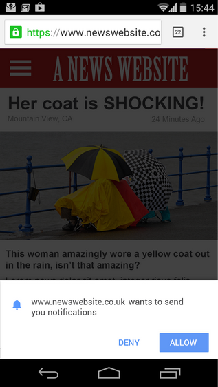

project_path: /web/_project.yaml
book_path: /web/fundamentals/_book.yaml
description: Requesting permission for and subscribing users to notifications requires as  light a touch as showing them notifications.

{# wf_review_required #}
{# wf_updated_on: 2016-06-30 #}
{# wf_published_on: 2016-06-30 #}

# Requesting permission and subscribing users {: .page-title }



Requesting permission for and subscribing users to notifications requires as
light a touch as showing them notifications.

## Check permissions {#check-permissions}

Always check for an existing permission when the page loads. If the permission
has already been granted you'll be able to start sending notifications
immediately. Either way use this information to set the state of permission
settings. An example of this is shown below. To be clear, we're not asking for
anything yet.

Note: For the sake of clarity, this example excludes a number of feature checks that you should always perform. You can view the original code in it's entirety in our <a href='https://github.com/GoogleChrome/samples/tree/gh-pages/push-messaging-and-notifications'>GitHub samples repo</a>.

    function initialiseState() {
      if (Notification.permission !== 'granted') {
        console.log('The user has not granted the notification permission.');
        return;
      }
      
      navigator.serviceWorker.ready.then(function(serviceWorkerRegistration) {
        serviceWorkerRegistration.pushManager.getSubscription()
          .then(function(subscription) {
            if (!subscription) {
              // Set appropriate app states.
              return;
            }
          })
          .catch(function(err) {
            console.log('Error during getSubscription()', err);
          });
      });
    }
    

## Avoid page-load subscription requests {#avoid-page-load-requests}

Notice one thing the previous example does _not_ do. It does not call 
`pushManager.subscribe()`, though this would seem to be the logical response to
finding that no existing subscription exists. Such requests may seem timely.
But, since you don't yet know anything about your users, and they may not 
know anything about you, it's difficult to send them pricise or relevant
messages.

## Requesting permission {#requesting-permission}

<figure class="attempt-right">
  
</figure>

Regardless of when you do it, requesting permission is a two-step process.
First, ask whether your application can send notifications using a message that
explains exactly why you want to send them notifications.

If the user approves, we need to send a subscription request to the push
manager. Do this by calling `PushManager.subscribe()` (emphasized in the
example below). In this example, we're passing it an object with
`userVisibleOnly` set to `true` so that all push messages  sent the client will
be shown to the user as a notification. We're also  including an
`applicationServerKey` converted to an integer array.

<pre class="prettyprint">
if ('showNotification' in ServiceWorkerRegistration.prototype) {
  navigator.serviceworker.ready
  .then(registration => {
    if (!subscription) {
      <strong>return registration.pushManager.subscribe({
          userVisibleOnly: true,
          applicationServerKey: window.base64UrlToUint8Array(
            '3xt3rm1n8_totallyFakePublicKey_a10nZ13'
          );</strong>
    }
    return subscription;
  })
  .then(subscription => {
    // Do something with the subscription.
  })
  .catch(error => {
    // Do something with the error.
  });
}
</pre>

This is the result in Chrome.

{:width="296px"}

## Trigger from a specific action {#trigger-from-action}

<figure class="attempt-right">
  
</figure>

Ask for permission to send notifications in response to a specific,
contextual user action. This allows you to tie your notifications
to a user's goal and makes it clear to the user why you want to send
notifications.

For example, If an airline site wanted to notify users of flight delays,
they would prominently display an opt-in checkbox and only ask for
notification permissions after the user chooses to opt in.

## Provide a place to manage notifications {#manage-notifications}

Make it easy for users to change and even disable notifications for your site.
It prevents users from killing notifications at the browser or device level.

Add a notification switch in a place with high visibility. Also, label it to
show users what you want to send them, not how it's implemented. Users have no
more idea what a 'push notification' is than you would know how to adjust the
orbit of a Soyuz capsule.

  <figure>
    
    <figcaption class="success">
      <b>Do:</b> A notifications switch that shows what notifications will contain.
    </figcaption>
  </figure>

  <figure>
    
    <figcaption class="warning">
      <b>Don’t:</b> A notifications switch that shows how notifications are implemented.
    </figcaption>
  </figure>

## Passing a subscription to the server {#passing-subscription}

After getting a user's permission to send notifications and setting the state of
related controls, you need to send the subscription information (called the
"Push Resource" in the spec) to the push server. This involves creating an
appropriate request object containing the subscription data, then passing it to
the server.

When you create the request (emphasized in the example below), use the  `POST`
verb and a `Content-Type` header of  `application/json`. For the body you need
to convert the subscription object to a  string. We'll look at what's in this
object in the next section, [Sending  messages](sending-messages). Use `fetch()`
to send the subscription request to the server.

<pre class="prettyprint">
if ('showNotification' in ServiceWorkerRegistration.prototype) {
  navigator.serviceworker.ready
  .then(registration => {
    if (!subscription) {
      return registration.pushManager.subscribe({
        userVisibleOnly: true,
        applicationServerKey: window.base64UrlToUint8Array(
          '3xt3rm1n8_totallyFakePublicKey_a10nZ13'
         );
      })
    }
    return subscription;
  })
  <strong>.then(subscription => {
    var fetchOptions = {
      method: 'post',
      headers: new Headers({
        'Content-Type': 'application/json'
      }),
      body: JSON.stringify(subscription)</strong>
    };
    return fetch('/your-web-server/api', fetchOptions);
  })
  .catch(error => {
    // Do something with the error.
  });
}
</pre>
