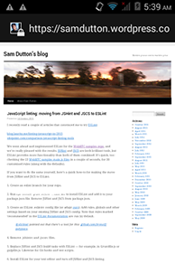
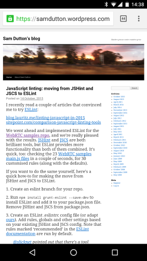
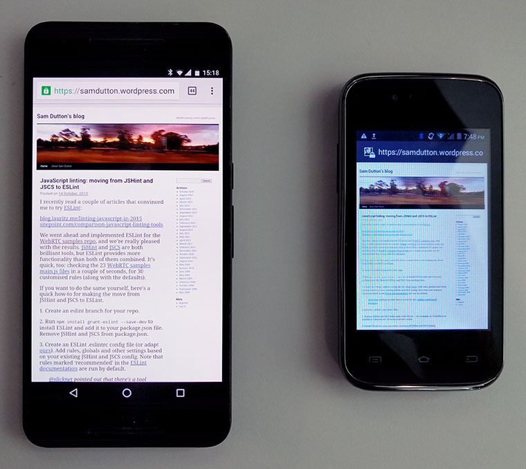
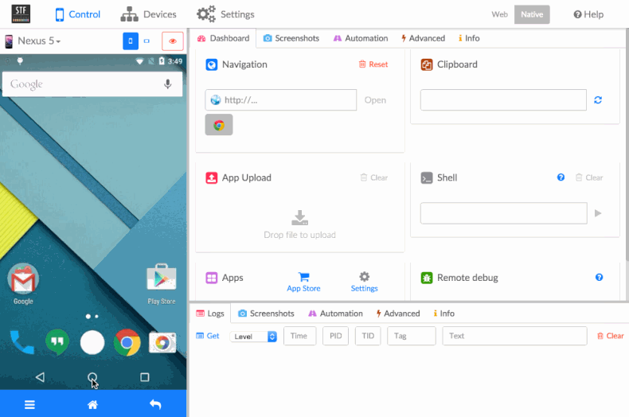

project_path: /web/_project.yaml
book_path: /web/_book.yaml
description: Great designers don't 'optimize for mobile' — they think responsively to build sites that work across a range of devices. The structure of text and other page content is critical to cross-device success.

"Create a product, don't re-imagine one for small screens. Great mobile products are created, never ported."
— <a href="https://goo.gl/KBAXj0">Mobile Design and Development</a>, Brian Fling

Great designers don't "optimize for mobile" — they think responsively to build sites that work across a range of devices. The structure of text and other page content is critical to cross-device success.

Many of the next billion users coming online use low-cost devices with small viewports. Reading on a low resolution 3.5" or 4" screen can be hard work.

Here is a screenshot from a typical low cost mobile phone:

Compare that with a high end phone:

Here is a photograph of the two together:

On the larger screen, text is small but readable.

On the smaller screen the browser renders the layout correctly, but the text is unreadable, even when zoomed in. The display is blurry and has a 'color cast' — white doesn't look white — making content less legible.

## Design content for mobile

When building for a range of viewports, consider content as well as layout and graphic design:

* Learn how to [write for mobile](write.html).
* [Design with real text and images, not dummy content](http://uxmyths.com/post/718187422/myth-you-dont-need-the-content-to-design-a-website).

> "Content precedes design. Design in the absence of content is not design, it's decoration."
> — Jeffrey Zeldman
>
> "Text is a UI."
> — Jakob Nielsen

* [Eliminate unnecessary images](redundant.html) and other redundant content.
* Put your most important content at the top, since [users tend to read web pages in an F-shaped pattern](https://www.nngroup.com/articles/f-shaped-pattern-reading-web-content/).
* Users visit your site to achieve a goal. Ask yourself what they need to achieve that goal and get rid of everything else. Get tough on visual and textual embellishments, legacy content, excessive links, and other clutter.
* Be careful with social sharing icons; they can clutter layouts, and the code for them can slow down page loading.
* Design [responsive layouts](/web/fundamentals/design-and-ui/responsive/?hl=en) for content, not fixed device sizes.

## Test content

Whatever you do — **test**!

* Check readability on smaller viewports using Chrome DevTools and other [emulation tools](/web/fundamentals/performance/poor-connectivity/testing).
* [Test your content under conditions of low bandwidth and high latency](/web/fundamentals/performance/poor-connectivity/testing); try out content in a variety of connectivity scenarios.
* Try reading and interacting with your content on a low-cost phone.
* Ask friends and colleagues to try out your app or site.
* Build a simple device test lab. The [GitHub repo](https://github.com/GoogleChrome/MiniMobileDeviceLab) for Google's Mini Mobile Device Lab has instructions on how to build your own. [OpenSTF](https://github.com/openstf/stf) is a simple web application for testing websites on multiple Android devices.  Here is OpenSTF in action:

Mobile devices are increasingly used to consume content and obtain information — not just as devices for communication, games and media.

This makes it increasingly import to plan content to work well on a range of viewports, and to prioritize content when considering cross-device layout, interface and interaction design.

