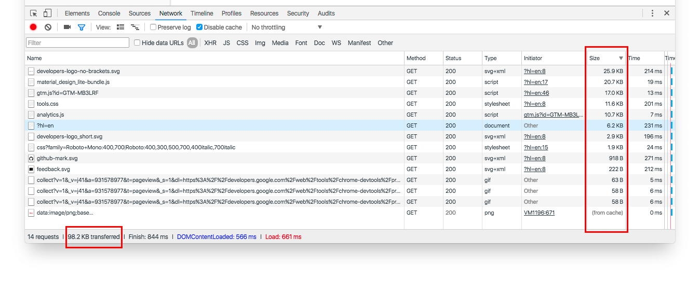

Web pages are getting bigger.   According to <a href="http://httparchive.org/trends.php#bytesTotal&reqTotal">HTTP Archive</a>, the average page weight for the <a href="http://httparchive.org/about.php#listofurls">top one million sites</a> is now over 2MB.

Users avoid sites or apps perceived to be slow or expensive, so it's crucial to understand the cost of loading page and app components.

Reducing page weight can also be profitable. [Chris Zacharias from YouTube](http://blog.chriszacharias.com/page-weight-matters) found that when they reduced the watch-page size from 1.2MB to 250KB:

> Large numbers of people who were previously unable to use YouTube before were suddenly able to.

In other words, reducing page weight **can open up whole new markets**.

## Calculate page weight

There are a number of tools for calculating page weight. The Chrome DevTools Network panel shows the total byte size for all resources, and can be used to ascertain weights for individual asset types. You can also check which items have been retrieved from the browser cache.

Firefox and other browsers offer similar tools.

[WebPagetest](http://webpagetest.org) provides the ability to test first and subsequent page loads. You can automate testing with [scripts](https://sites.google.com/a/webpagetest.org/docs/using-webpagetest/scripting) (for example, to log in to a site) or by using their [RESTful APIs](https://sites.google.com/a/webpagetest.org/docs/advanced-features/webpagetest-restful-apis). The following example (loading [developers.google.com/web](https://developers.google.com/web/)) shows that caching was successful and that subsequent page loads required no additional resources.

WebPagetest also gives a size and request breakdown by MIME type.

## Calculate page cost

For many users, data doesn't just cost bytes and performance — it costs money.

The site [What Does My Site Cost?](https://whatdoesmysitecost.com/) enables you to estimate the actual financial cost of loading your site. The histogram below shows how much it costs (using a prepaid data plan) to load [amazon.com](https://www.amazon.com/).

Bear in mind that this doesn't take into account affordability relative to income. Data from [blog.jana.com](https://blog.jana.com/2015/05/21/the-data-trap-affordable-smartphones-expensive-data/) shows the cost of data.

<table>
  <tr>
    <td></td>
    <td><strong>500MB data plan cost (USD)</strong></td>
    <td><strong>Hourly minimum wage (USD)</strong></td>
    <td><strong>Hours of work to pay for 500MB data plan</strong></td>
  </tr>
  <tr>
    <td>India</td>
    <td>$3.38</td>
    <td>$0.20</td>
    <td>17 hours</td>
  </tr>
  <tr>
    <td>Indonesia</td>
    <td>$2.39</td>
    <td>$0.43</td>
    <td>6 hours</td>
  </tr>
  <tr>
    <td>Brazil</td>
    <td>$13.77</td>
    <td>$1.04</td>
    <td>13 hours</td>
  </tr>
</table>

Page weight isn't just a problem for emerging markets. In many countries, people use mobile plans with limited data, and will avoid your site or app if they perceive it to be heavy and expensive. Even "unlimited" cell and wifi data plans generally have a data limit beyond which they are blocked or throttled.

The bottom line: page weight affects performance and costs money. [Optimizing content efficiency](https://developers.google.com/web/fundamentals/performance/optimizing-content-efficiency/?hl=en]) shows how to reduce that cost.

### Topics

  [Write for mobile](/web/fundamentals/design-and-ui/content/write?hl=en)

  [Eliminate unnecessary content](/web/fundamentals/design-and-ui/content/redundant?hl=en)

  [Design content to work well across different viewport sizes](/web/fundamentals/design-and-ui/content/viewport?hl=en)

  [Understand data cost](/web/fundamentals/design-and-ui/content/weight?hl=en)

