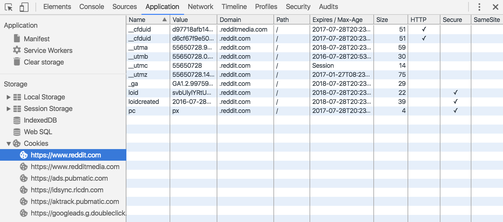

project_path: /web/_project.yaml
book_path: /web/tools/_book.yaml
description: Inspect and delete cookies from the Application panel.

{# wf_review_required #}
{# wf_updated_on: 2016-07-28 #}
{# wf_published_on: 2015-04-13 #}

# Inspect and Delete Cookies {: .page-title }



Inspect and delete cookies from the
<strong>Application</strong> panel.

## TL;DR
- 'View detailed information about a cookie, such as its name, value, domain, size, and more.'
- 'Delete a single cookie, cookies from a selected domain, or all cookies from all domains.'

## Overview {#cookies}

Use the **Cookies** pane to view and delete cookies. You cannot modify cookie
values.

![cookies pane][cookies]

Cookies are listed by domain. This includes the main document as well as all
nested frames. Selecting one of these “frame groups” displays all cookies, for
all resources, for all frames in that group. There are two consequences of
this grouping to be aware of:

* Cookies from different domains may appear in the same frame group.
* The same cookie may appear in several frame groups.

[cookies]: /web/tools/chrome-devtools/iterate/manage-data/imgs/cookies.png

## Fields {#fields}

The following fields are provided for each cookie:

<table class="mdl-data-table">
  <thead>
    <tr>
      <th>Cookie Field</th>
      <th>Description</th>
    </tr>
  </thead>
  <tbody>
        <tr>
      <td data-th="Cookie Field">Name</td>
      <td data-th="Description">The cookie's name.</td>
    </tr>
    <tr>
      <td data-th="Cookie Field">Value</td>
      <td data-th="Description">The cookie's value.</td>
    </tr>
    <tr>
      <td data-th="Cookie Field">Domain</td>
      <td data-th="Description">The cookie's domain.</td>
    </tr>
    <tr>
      <td data-th="Cookie Field">Path</td>
      <td data-th="Description">The cookie's path.</td>
    </tr>
    <tr>
      <td data-th="Cookie Field">Expires / Maximum Age</td>
      <td data-th="Description">The cookie's expiration time, or maximum age. For session cookies, this field is always "Session".</td>
    </tr>
    <tr>
      <td data-th="Cookie Field">Size</td>
      <td data-th="Description">The cookie's size in bytes.</td>
    </tr>
    <tr>
      <td data-th="Cookie Field">HTTP</td>
      <td data-th="Description">If present, indicates that cookies should be used only over HTTP, and JavaScript modification is not allowed.</td>
    </tr>
    <tr>
      <td data-th="Cookie Field">Secure</td>
      <td data-th="Description">If present, indicates that communication for this cookie must be over an encrypted transmission.</td>
    </tr>
  </tbody>
</table>

## Delete cookies {#delete}

There are a few ways you can delete cookies:

* Select a cookie and press the **delete** button
  (![delete button][delete]{:.inline}) to delete just that cookie.
* Press the **clear** button (![clear button][cos]{:.inline}) to delete all
  cookies for the specified frame group.
* Right-click on the **Domain** value of a cookie and select **Clear all
  from "..."** (where **"..."** is the name of the domain) to delete all cookies
  from that domain.

[delete]: imgs/delete.png
[cos]: imgs/clear-object-store.png
