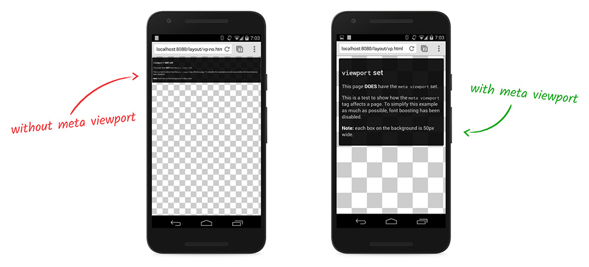
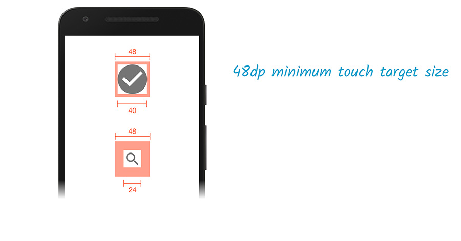
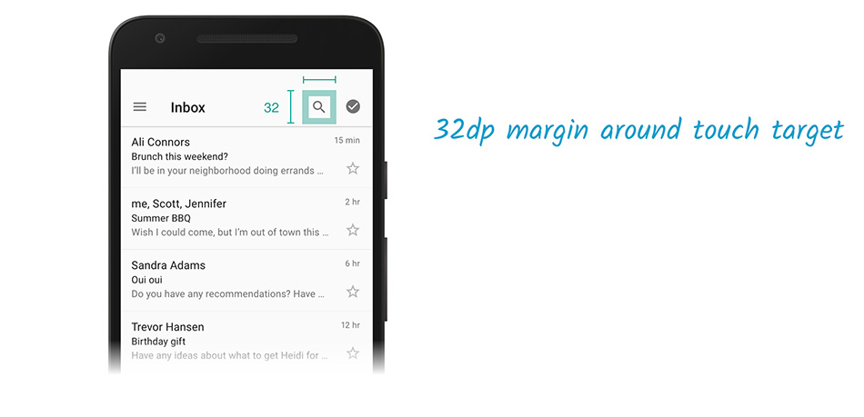
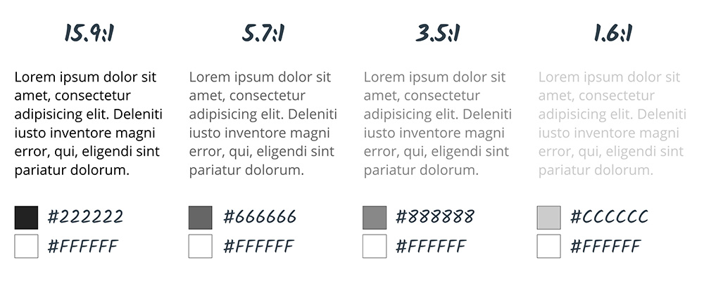
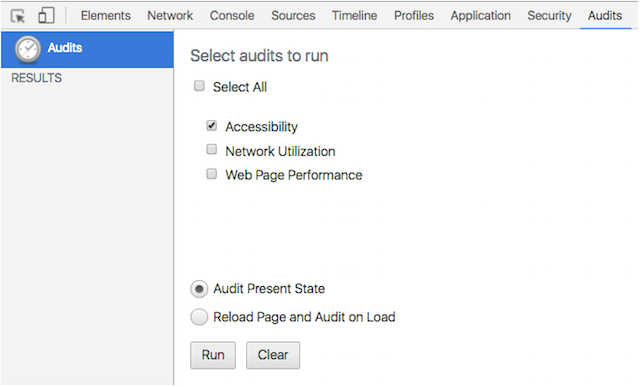
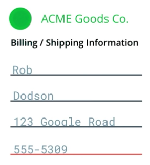
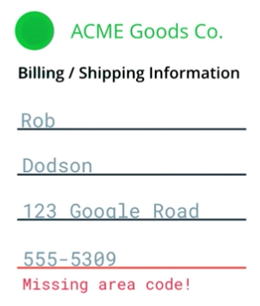

project_path: /web/_project.yaml
book_path: /web/fundamentals/_book.yaml
description: Using proper styling to improve accessibility


{# wf_updated_on: 2016-10-04 #}
{# wf_published_on: 2016-10-04 #}

# Accessible Styles {: .page-title }






We've explored two of the crucial pillars of accessibility, focus and semantics.
Now let's tackle the third, styling. It's a broad topic that we can cover in
three sections.

 - Ensuring that elements are styled to support our accessibility efforts by
   adding styles for focus and various ARIA states.
 - Styling our UIs for flexibility so they can be zoomed or scaled to
   accommodate users who may have trouble with small text.
 - Choosing the right colors and contrast to avoid conveying information with
   color alone.

## Styling focus

Generally, any time we focus an element, we rely on the built-in browser focus
ring (the CSS `outline` property) to style the element. The focus ring is handy
because, without it, it's impossible for a keyboard user to tell which element
has the focus. The [WebAIM
checklist](http://webaim.org/standards/wcag/checklist){: .external } makes a
point of this, requiring that "It is visually apparent which page element has
the current keyboard focus (i.e., as you tab through the page, you can see where
you are)."


However, sometimes the focus ring can look distorted or it may just not fit in
with your page design. Some developers remove this style altogether by setting
the element's `outline` to `0` or `none`. But without a focus indicator, how is
a keyboard user supposed to know which item they're interacting with?

Warning: Never set outline to 0 or none without providing a focus alternative!

You might be familiar with adding hover states to your controls using the CSS
`:hover` *pseudo-class*. For example, you might use `:hover` on a link element
to change its color or background when the mouse is over it. Similar to
`:hover`, you can use the `:focus` pseudo-class to target an element when it has
focus.

    /* At a minimum you can add a focus style that matches your hover style */
    :hover, :focus {
      background: #c0ffee;
    }

An alternative solution to the problem of removing the focus ring is to give
your element the same hover and focus styles, which solves the
"where's-the-focus?" problem for keyboard users. As usual, improving the
accessibility experience improves everyone's experience.

### Input modality

{: .attempt-right }

For native elements like `button`, browsers can detect whether user interaction
occurred via the mouse or the keyboard press, and typically only display the
focus ring for keyboard interaction. For example, when you click a native
`button` with the mouse there is no focus ring, but when you tab to it with the
keyboard the focus ring appears.

The logic here is that mouse users are less likely to need the focus ring
because they know what element they clicked. Unfortunately there isn't currently
a single cross-browser solution that yields this same behavior. As a result, if
you give any element a `:focus` style, that style will display when *either* the
user clicks on the element or focuses it with the keyboard. Try clicking on this
fake button and notice the `:focus` style is always applied.

    <style>
      fake-button {
        display: inline-block;
        padding: 10px;
        border: 1px solid black;
        cursor: pointer;
        user-select: none;
      }

      fake-button:focus {
        outline: none;
        background: pink;
      }
    </style>
    <fake-button tabindex="0">Click Me!</fake-button>


<style>
  fake-button {
    display: inline-block;
    padding: 10px;
    border: 1px solid black;
    cursor: pointer;
    user-select: none;
  }

  fake-button:focus {
    outline: none;
    background: pink;
  }
</style>
<fake-button tabindex="0">Click Me!</fake-button>


This can be a bit annoying, and often times developer will resort to using
JavaScript with custom controls to help differentiate between mouse and keyboard
focus.

In Firefox, the `:-moz-focusring` CSS pseudo-class allows you to write a focus
style that is only applied if the element is focused via the keyboard, quite a
handy feature. While this pseudo-class is currently only supported in Firefox,
[there is currently work going on to turn it into a
standard](https://github.com/wicg/modality){: .external }.

There is also [this great article by Alice Boxhall and Brian
Kardell](http://radar.oreilly.com/2015/08/proposing-css-input-modailty.html){: .external }
that explores the topic of modality and contains prototype code for
differentiating between mouse and keyboard input. You can use their solution
today, and then include the focus ring pseudo-class later when it has more
widespread support.

## Styling states with ARIA

When you build components, it's common practice to reflect their state, and thus
their appearance, using CSS classes controlled with JavaScript.

For example, consider a toggle button that goes into a "pressed" visual state
when clicked and retains that state until it is clicked again. To style the
state, your JavaScript might add a `pressed` class to the button. And, because
you want good semantics on all your controls, you would also set the
`aria-pressed` state for the button to `true`.

A useful technique to employ here is to remove the class altogether, and just
use the ARIA attributes to style the element. Now you can update the CSS
selector for the pressed state of the button from this


    .toggle.pressed { ... }
    

to this.


    .toggle[aria-pressed="true"] { ... }
    

This creates both a logical and a semantic relationship between the ARIA state
and the element's appearance, and cuts down on extra code as well.

## Multi-device responsive design

We know that it's a good idea to design responsively to provide the best
multi-device experience, but responsive design also yields a win for
accessibility.

Consider a site like [Udacity.com](https://www.udacity.com/courses/all):


A low-vision user who has difficulty reading small print might zoom in the page,
perhaps as much as 400%. Because the site is designed responsively, the UI will
rearrange itself for the "smaller viewport" (actually for the larger page),
which is great for desktop users who require screen magnification and for mobile
screen reader users as well. It's a win-win. Here's the same page magnified to
400%:


In fact, just by designing responsively, we're meeting [rule 1.4.4 of the WebAIM
checklist](http://webaim.org/standards/wcag/checklist#sc1.4.4){: .external },
which states that a page "...should be readable and functional when the text
size is doubled."

Going over all of responsive design is outside the scope of this guide, but
here are a few important takeaways that will benefit your responsive experience
and give your users better access to your content.

 - First, make sure you always use the proper `viewport` meta tag.

   ```
   <meta name="viewport" content="width=device-width, initial-scale=1.0">
   ```
   
   Setting `width=device-width`
   will match the screen's width in device-independent pixels, and setting
   `initial-scale=1` establishes a 1:1 relationship between CSS pixels and
   device-independent pixels. Doing this instructs the browser to fit your
   content to the screen size, so users don't just see a bunch of scrunched-up
   text.



Warning: When using the viewport meta tag, make sure you don't set
maximum-scale=1 or set user-scaleable=no. Let users zoom if they need to!

 - Another technique to keep in mind is designing with a responsive grid. As you
   saw with the Udacity site, designing with a grid means your content will
   reflow when the page changes size. Often these layouts are produced using
   relative units like percents, ems, or rems instead of hard-coded pixel
   values. The advantage of doing it this way is that text and content can
   enlarge and force other items down the page. So the DOM order and the reading
   order remain the same, even if the layout changes because of magnification.

 - Also, consider using relative units like `em` or `rem` for things like text
   size, instead of pixel values. Some browsers support resizing text only in
   user preferences, and if you're using a pixel value for text, this setting
   will not affect your copy. If, however, you've used relative units
   throughout, then the site copy will update to reflect the user's preference.

 - Finally, when your design is displayed on a mobile device, you should ensure
   that interactive elements like buttons or links are large enough, and have
   enough space around them, to make them easy to press without accidentally
   overlapping onto other elements. This benefits all users, but is especially
   helpful for anyone with a motor impairment.

A minimum recommended touch target size is around 48 device independent pixels
on a site with a properly set mobile viewport. For example, while an icon may
only have a width and height of 24px, you can use additional padding to bring
the tap target size up to 48px. The 48x48 pixel area corresponds to around 9mm,
which is about the size of a person's finger pad area.



Touch targets should also be spaced about 32 pixels
apart, both horizontally and vertically, so that a user's finger pressing on one
tap target does not inadvertently touch another tap target.



## Color and contrast

If you have good vision, it's easy to assume that everyone perceives colors, or
text legibility, the same way you do &mdash; but of course that's not the case.
Let's wrap things up by looking at how we can effectively use color and contrast
to create pleasant designs that are accessible to everyone.

As you might imagine, some color combinations that are easy for some people to
read are difficult or impossible for others. This usually comes down to *color
contrast*, the relationship between the foreground and background colors'
*luminance*. When the colors are similar, the contrast ratio is low; when they
are different, the contrast ratio is high.

The [WebAIM guidelines](http://webaim.org/standards/wcag/){: .external }
recommend an AA (minimum) contrast ratio of 4.5:1 for all text. An exception is
made for very large text (120-150% larger than the default body text), for which
the ratio can go down to 3:1. Notice the difference in the contrast ratios shown
below.



The contrast ratio of 4.5:1 was chosen for level AA because it compensates for
the loss in contrast sensitivity usually experienced by users with vision loss
equivalent to approximately 20/40 vision. 20/40 is commonly reported as typical
visual acuity of people at about age 80. For users with low vision impairments
or color deficiencies, we can increase the contrast up to 7:1 for body text.

You can use the [Accessibility DevTools
extension](https://chrome.google.com/webstore/detail/accessibility-developer-t/fpkknkljclfencbdbgkenhalefipecmb){: .external }
for Chrome to identify contrast ratios. One benefit of using the Chrome Devtools
is that they will suggest AA and AAA (enhanced) alternatives to your current
colors, and you can click the values to preview them in your app.

To run a color/contrast audit, follow these basic steps.

 1. After installing the extension, click `Audits`
 1. Uncheck everything except `Accessibility`
 1. Click `Audit Present State`
 1. Note any contrast warnings



WebAIM itself provides a handy [color contrast
checker](http://webaim.org/resources/contrastchecker/){: .external } you can use
to examine the contrast of any color pair.

### Don't convey information with color alone

There are roughly 320 million users with color vision deficiency. About 1 in 12
men and 1 in 200 women have some form of "color blindness"; that means about
1/20th, or 5%, of your users will not experience your site the way you intended.
When we rely on color to convey information, we push that number to unacceptable
levels.

Note: The term "color blindness" is often used to describe a visual condition
where a person has trouble distinguishing colors, but in fact very few people
are truly color blind. Most people with color deficiencies can see some or most
colors, but have difficulty differentiating between certain colors such as reds
and greens (most common), browns and oranges, and blues and purples.

For example, in an input form, a telephone number might be underlined in red to
show that it is invalid. But to a color deficient or screen reader user, that
information is not conveyed well, if at all. Thus, you should always try to
provide multiple avenues for the user to access critical information.



The [WebAIM checklist states in section
1.4.1](http://webaim.org/standards/wcag/checklist#sc1.4.1){: .external } that
"color should not be used as the sole method of conveying content or
distinguishing visual elements." It also notes that "color alone should not be
used to distinguish links from surrounding text" unless they meet certain
contrast requirements. Instead, the checklist recommends adding an additional
indicator such as an underscore (using the CSS `text-decoration` property) to
indicate when the link is active.

An easy way to fix the previous example is to add an additional message to the
field, announcing that it is invalid and why.



When you're building an app, keep these sorts of things in mind and watch out
for areas where you may be relying too heavily on color to convey important
information.

If you're curious about how your site looks to different people, or if you rely
heavily on the use of color in your UI, you can use the [NoCoffee Chrome
extension](https://chrome.google.com/webstore/detail/nocoffee/jjeeggmbnhckmgdhmgdckeigabjfbddl){: .external }
to simulate various forms of visual impairment, including different types of
color blindness.

### High contrast mode

High-contrast mode allows a user to invert foreground and background colors,
which often helps text stand out better. For someone with a low vision
impairment, high-contrast mode can make it much easier to navigate the content
on the page. There are a few ways to get a high-contrast setup on your machine.

Operating systems like Mac OSX and Windows offer high-contrast modes that can be
enabled for everything at the system level. Or users can install an extension,
like the [Chrome High Contrast
extension](https://chrome.google.com/webstore/detail/high-contrast/djcfdncoelnlbldjfhinnjlhdjlikmph){: .external }
to enable high-contrast only in that specific app.

A useful exercise is to turn on high-contrast settings and verify that all of
the UI in your application is still visible and usable.

For example, a navigation bar might use a subtle background color to indicate
which page is currently selected. If you view it in a high-contrast extension,
that subtlety completely disappears, and with it goes the reader's understanding
of which page is active.


Similarly, if you consider the example from the previous lesson, the red
underline on the invalid phone number field might be displayed in a
hard-to-distinguish blue-green color.


If you are meeting the contrast ratios covered in the previous lessons you
should be fine when it comes to supporting high-contrast mode. But for added
peace of mind, consider installing the Chrome High Contrast extension and giving
your page a once-over just to check that everything works, and looks, as
expected.
