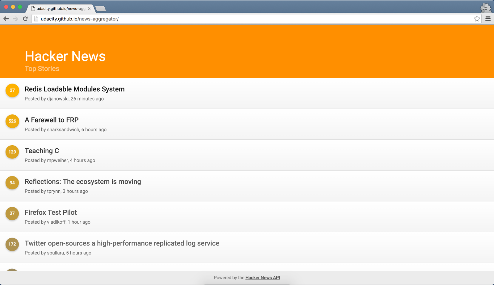
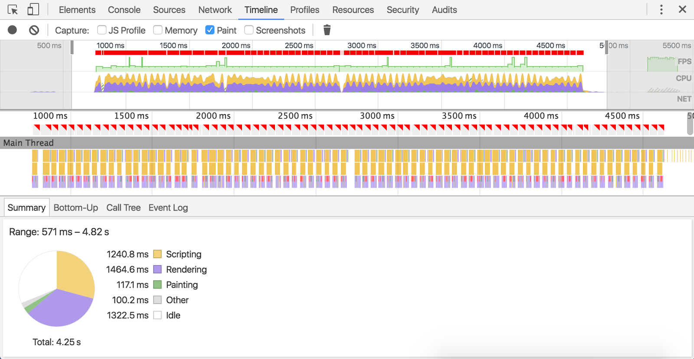
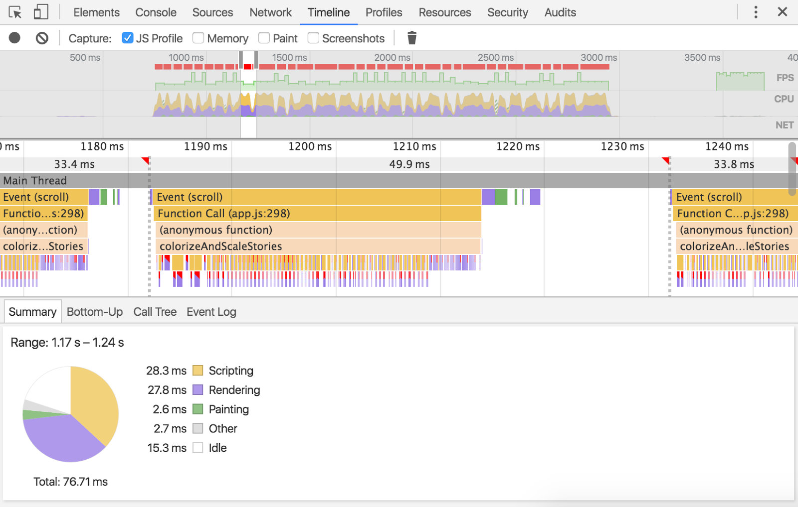
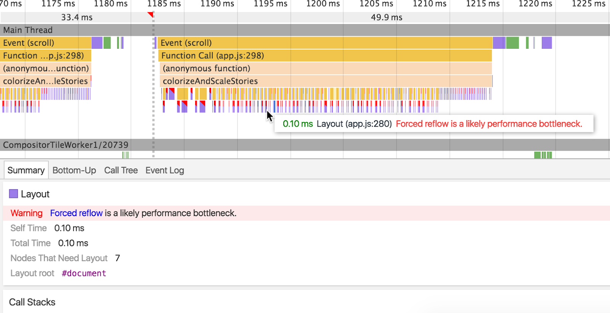
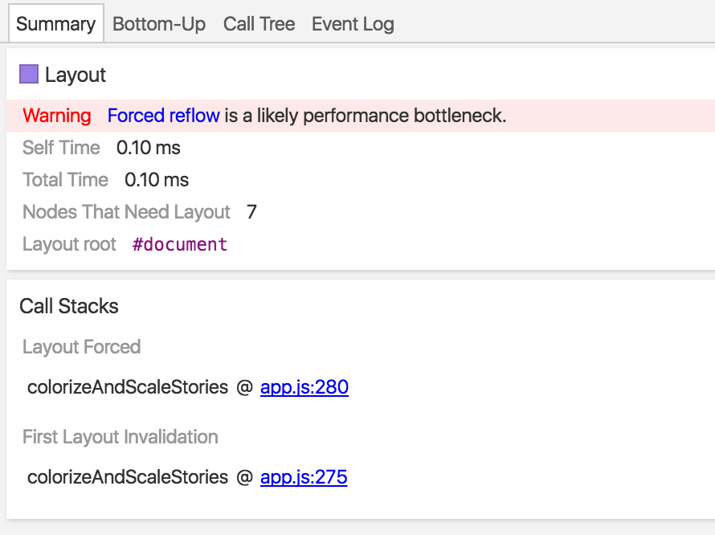
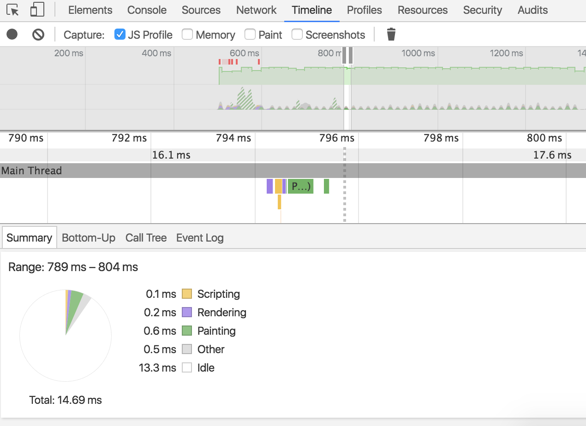
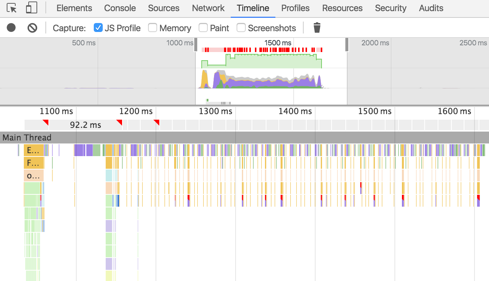
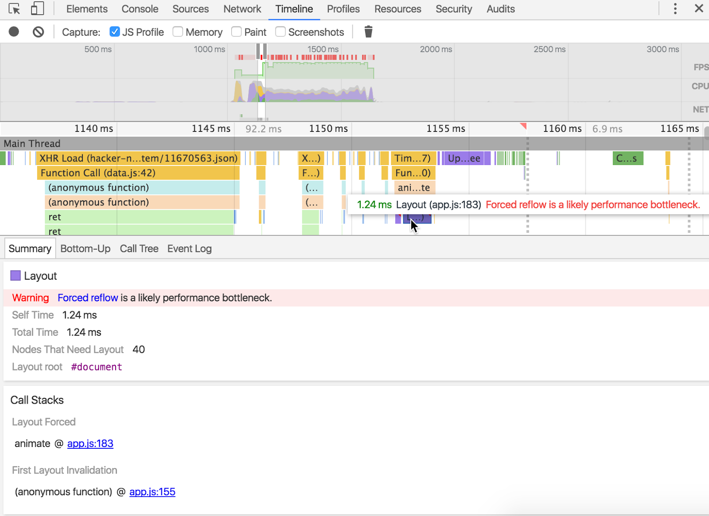
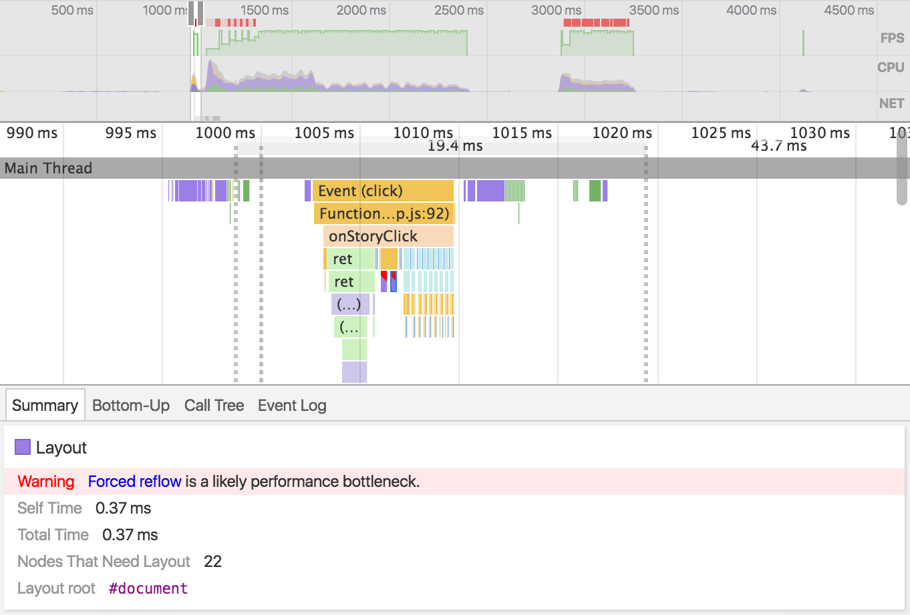
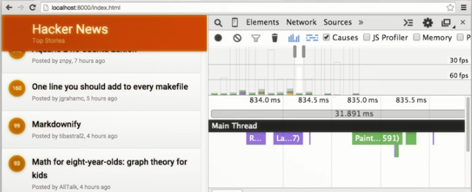

project_path: /web/_project.yaml
book_path: /web/fundamentals/_book.yaml
description: This codelab will help you learn to identify and fix web app performance bottlenecks.

{# wf_updated_on: 2016-06-16T18:31:26Z #}


# Find and Fix Web App Performance Issues {: page-title }




## Introduction


This codelab is a text-based version of part of the content covered in a Udacity course on app/web performance ( [ud860](https://www.udacity.com/course/viewer#!/c-ud860/l-4138328558/m-4157078575)). Rather than a transcription of the video course, this codelab is meant to be a lean, to-the-point treatment of jank identification and correction, using the course's original hands-on final project.


## Overview


We have all seen apps whose displays tend to jump raggedly during animations, scrolling, or other user interactions. This visible inconsistency is a performance issue commonly called  *jank*  or  *judder*  and is an annoying distraction for users; it interrupts their flow of thought while using the app and it makes the app look less polished and professional.

If the browser takes too long to make and display a frame, it gets skipped and you don't see the frame at all. Instead, you see the next one (or the one after that), and the object jumps across the gap instead of smoothly moving through it.

The jank phenomenon can be avoided by ensuring that an app runs at a consistent sixty frames per second (60fps). Many factors contribute to an app's frame rate, and there are various ways to code JavaScript and CSS to reduce or eliminate jank and achieve the desired rate.

This codelab is about changing the way you approach app performance issues by helping you find and fix frame display bottlenecks that cause jank.

### What you should know before you start

*  *Critical rendering path:*  You should understand the rendering pipeline and how JavaScript and CSS affect it. Learn more here:  [https://developers.google.com/web/fundamentals/performance/critical-rendering-path/](https://developers.google.com/web/fundamentals/performance/critical-rendering-path/) and here: Udacity course on  [Website Performance Optimization: The Critical Rendering Path](https://www.udacity.com/course/website-performance-optimization--ud884)__.__
*  *Frames and frame rate:*  You should know how the browser constructs frames and why the 60fps rate is important for a smooth display. Learn more here:  [https://developers.google.com/web/fundamentals/performance/rendering/](https://developers.google.com/web/fundamentals/performance/rendering/) and here: Udacity course on  [Browser Rendering Optimization: Building 60 FPS Web Apps](https://www.udacity.com/course/browser-rendering-optimization--ud860).
*  *Application life cycle:*  You should understand the Response, Animation, Idle, and Load parts of a running app and recognize the windows of opportunity that each part presents. Learn more here:  [The RAIL Performance Model](https://developers.google.com/web/tools/profile-performance/evaluate-performance/rail)
*  *Chrome DevTools:*  You should have a basic understanding of DevTools and how to use them to analyze a web app, especially the Timeline tool. Learn more here:  [Analyze Runtime Performance](https://developers.google.com/web/tools/profile-performance/rendering-tools/analyze-runtime).

### What you'll learn in this codelab

* How to identify application code that causes display performance bottlenecks
* How to analyze and modify the code to reduce or eliminate the bottlenecks

### What you'll need in your development workspace

* Google Chrome browser, DevTools
* The sample code for the hands-on project (see below)

### Jank/Judder

Let's get familiar with jank by playing a game, "Jank Invaders" by Jake Archibald. It's designed to demonstrate problems with frame rates and performance. Here's a screen shot.


In the game, spaceships move across the screen. The good guys move smoothly, while the bad guys ("spy ships") are janky. Your job: identify and shoot down the ten janky spy ships among the smooth ones by clicking them as quickly as you can.  [Here's the link to the game](http://jakearchibald.github.io/jank-invaders/). Go ahead, have fun; come back when you're finished.

Clearly, users notice jank and almost invariably choose apps that perform better, and it's no different with the web: bad performance kills good sites. This codelab will help you think about your projects' performance and explore how to identify and correct common issues. You'll hunt down causes of sticky scrolling, flickering updates, and juddering animations, with the goal of reaching a smooth and seamless 60fps frame rate.


## The Project App


Let's begin by taking a look at the app that you'll be debugging in this codelab. It looks like this.



This site uses the __Hacker News API__ to show recent stories and their scores. Right now the app's performance is very poor, especially on mobile, but there's no reason it shouldn't be hitting 60fps. By the end of this codelab, you'll have the skills, techniques, and -- most importantly -- the mindset needed to turn this janky app into an attractive and efficient 60fps experience.

### Get the Project Code

First, you should get the application code, both the "before" and "after" versions. You can either clone the repositories or just download the zip files.

* Here is the original app with performance bottlenecks in a  [GitHub repository](http://github.com/udacity/news-aggregator); also, here's the  [live site](http://udacity.github.io/news-aggregator/) if you'd like to see it. This is the version you'll work on.
* Here is the completed app without performance bottlenecks in a  [GitHub repository](https://github.com/udacity/news-aggregator/tree/solution). You can use this corrected version for reference.

### Run the original app

First, get the original janky version of the app up and running. In Chrome, open __index.html__ in the top-level folder (e.g., news-aggregator-master). Experiment with the app a bit; you'll quickly notice a couple of the high-level performance problems in the two major user interactions, scrolling within the main screen and story slide-in/out. We'll focus on those main issues to see how we can improve this janky app's performance.


## Exercise 1: List scrolling


During scrolling in the main screen, you'll notice that the story list judders. Also, you'll see that the individual story point indicators (the circled numbers) not only change values, but also change color. This exercise is about identifying these problems and deciding how to approach them.

Let's see what's really happening when we scroll the main screen, using the Timeline. Make sure that the __JS Profile__ checkbox is enabled before you start your recording. Start a new recording, scroll down the list a bit, and then stop the recording. 

At the top of the recording, you see an FPS indicator in green. You should see a green bar with some occasional spikes, like in the screenshot below. The fact that the green bar is so low indicates that the screen was not hitting 60 FPS.



Zoom in on your recording and you will see that after the scroll event is a function call, followed by many separate layout events, each with a red warning triangle. The layout events are the very skinny purple events at the bottom of the flame chart in the screenshot below. This is a sure sign that  *forced synchronous layout*  is occurring.



Hover to identify a layout event, and then click on it to view its details. 



Look at the details of a layout event, and you can see that the forced synchronous layout warning is being produced by the `colorizeAndScaleStories` function in app.js.



Let's examine that function.

```
function colorizeAndScaleStories() {

  var storyElements = document.querySelectorAll('.story');

  // It does seem awfully broad to change all the
  // colors every time!
  for (var s = 0; s < storyElements.length; s++) {

    var story = storyElements[s];
    var score = story.querySelector('.story__score');
    var title = story.querySelector('.story__title');

    // Base the scale on the y position of the score.
    var height = main.offsetHeight;
    var mainPosition = main.getBoundingClientRect();
    var scoreLocation = score.getBoundingClientRect().top -
        document.body.getBoundingClientRect().top;
    var scale = Math.min(1, 1 - (0.05 * ((scoreLocation - 170) / height)));
    var opacity = Math.min(1, 1 - (0.5 * ((scoreLocation - 170) / height)));

    score.style.width = (scale * 40) + 'px';
    score.style.height = (scale * 40) + 'px';
    score.style.lineHeight = (scale * 40) + 'px';

    // Now figure out how wide it is and use that to saturate it.
    scoreLocation = score.getBoundingClientRect();
    var saturation = (100 * ((scoreLocation.width - 38) / 2));

    score.style.backgroundColor = 'hsl(42, ' + saturation + '%, 50%)';
    title.style.opacity = opacity;
  }
}
```

Notice that `height`, `width`, and `line-height` are accessed, which cause layout to run. Opacity is also set and -- while an opacity change doesn't trigger layout -- this line of code applies a new style, which triggers recalculate and, again, layout. These two techniques used in the function's main loop are causing the forced synchronous layout problem. 

Next, consider the visual effect on the story point indicators, which doesn't add any informational value. We could achieve the effect with CSS properties instead of JavaScript, but we might be better off dropping the effect completely. The takeaway: sometimes the best code fix is code removal.

Let's remove the calls to the `colorizeAndScaleStories` function. Commend out lines 88, 89, and 305 in app.js, as well as the entire function itself, lines 255-286. Don't delete the lines, because the line numbers that we reference later in this codelab won't match your app. Now the story points look the same all the time.

Run the app again and take a Timeline recording of some scrolling activity, and then zoom in on a scroll event. This time, you'll see that there is only one style recalculation after the scroll, and that the FPS bar is much higher. 



The extra layouts and their forced synchronous layout warnings are gone, and frame rate is excellent. One jank problem solved!


## Exercise 2: Story concatenation


Another issue that affects the app's smoothness is the janky scrolling when stories are added to the list. Note the call to `loadStoryBatch` in the `scroll` event listener code.

```
main.addEventListener('scroll', function() {

  ...

  // Check if we need to load the next batch of stories.
  var loadThreshold = (main.scrollHeight - main.offsetHeight -
      LAZY_LOAD_THRESHOLD);
  if (main.scrollTop > loadThreshold)
    loadStoryBatch();
});
```

This function makes visible changes to the page by inserting new stories to the page as it's loaded, specifically by appending DOM nodes using `appendChild`. There's nothing inherently wrong in the function, nor in the design approach that uses it, but consider how it is being called.

The `loadStoryBatch` function is catch-as-catch-can; it runs whenever it needs to, based on the `loadThreshold` test, without regard to what else is going on in the page or where the browser is in the frame construction process. This is because the JavaScript engine pays no attention to the rendering pipeline when executing scripts. That immediacy will cause a performance problem, especially as more stories are added to the list. We can address this issue by using  *requestAnimationFrame* .

Ideally, anything that makes a visible change to the page should happen inside a requestAnimationFrame call. Let's make that modification to the `scroll` event listener code.

```
main.addEventListener('scroll', function() {

  ...

  // Check if we need to load the next batch of stories.
  var loadThreshold = (main.scrollHeight - main.offsetHeight -
      LAZY_LOAD_THRESHOLD);
  if (main.scrollTop > loadThreshold)
    requestAnimationFrame(loadStoryBatch);
});
```

This simple change ensures that our animation-related script runs early in the pipeline process, and provides a small but significant performance boost.


## Exercise 3: Story slide-in/out (part 1)


Another problem area for our news aggregator app is the basic action of sliding stories in and out. Apart from scrolling, this is the app's most common user interaction feature.

As usual, begin by taking a Timeline recording of a story sliding in and out, and examining the frame rate. The slide-in/out may actually range from a bit janky to basically unusable on various devices. Be sure to view the  [live site](http://udacity.github.io/news-aggregator/) on a mobile device, but it is problematic on all platforms.



In general, whenever you see a purple event with a red triangle on it, you want to investigate by hovering over it and clicking on it to view its details. Right now, you're interested in the forced synchronous layout that occurred after a timer was fired. 



The slide-in/out animation is firing a timer and there's a forced synchronous layout occurring. The details point to line 180 in the app.js file, which is a function called `animate`. Let's examine that function.

```
function animate () {

  // Find out where it currently is.
  var storyDetailsPosition = storyDetails.getBoundingClientRect();

  // Set the left value if we don't have one already.
  if (left === null)
        left = storyDetailsPosition.left;

  // Now figure out where it needs to go.
  left += (0 - storyDetailsPosition.left) * 0.1;

  // Set up the next bit of the animation if there is more to do.
  if (Math.abs(left) > 0.5)
        setTimeout(animate, 4);
  else
        left = 0;

  // And update the styles. Wait, is this a read-write cycle?
  // I hope I don't trigger a forced synchronous layout!
  storyDetails.style.left = left + 'px';
}
```

One of the first things you'll notice is the `setTimeout` that sets up the next call to `animate`. As you learned in the previous exercise, visible work that is done to the page should typically go inside a `requestAnimationFrame` call. But that `setTimeout` in particular is a problem.

The obvious -- and easy -- fix here is to force each call to `animate` to be scheduled at the beginning of its frame sequence by putting it inside a `requestAnimationFrame`.

```
function animate () {

  // Find out where it currently is.
  var storyDetailsPosition = storyDetails.getBoundingClientRect();

  // Set the left value if we don't have one already.
  if (left === null)
        left = storyDetailsPosition.left;

  // Now figure out where it needs to go.
  left += (0 - storyDetailsPosition.left) * 0.1;

  // Set up the next bit of the animation if there is more to do.
  if (Math.abs(left) > 0.5)
        requestAnimationFrame(animate);
  else
        left = 0;

  // And update the styles. Wait, is this a read-write cycle?
  // I hope I don't trigger a forced synchronous layout!
  storyDetails.style.left = left + 'px';
}
```

If you take another Timeline recording, you'll see a moderate to significant performance improvement, depending on the device.

Bonus question: Think about what's happening with story slide-in/out. We're just causing a story to appear and disappear on the page, revealing and hiding content. It seems to be a simple transition process; do we even need JavaScript for that, or could it be handled with CSS alone? We'll revisit this scenario in Exercise 5.


## Exercise 4: Memory waste


Janky animations aren't the only cause of poor performance in web apps and pages. Another major culprit is inefficient memory use and, as you might guess, our news aggregator app is guilty of that as well.

When a story headline in the main list is clicked, the app builds the story content, adds it to the page, and slides it into view. It's the "adds it to the page" part that needs examining. Conveniently, the function that handles a story click is called `onStoryClick`. Let's have a look at it.

```
function onStoryClick(details) {

  var storyDetails = $('sd-' + details.id);

  // Wait a little time then show the story details.
  setTimeout(showStory.bind(this, details.id), 60);

  // Create and append the story. A visual change...
  // perhaps that should be in a requestAnimationFrame?
  // And maybe, since they're all the same, I don't
  // need to make a new element every single time? I mean,
  // it inflates the DOM and I can only see one at once.
  if (!storyDetails) {

    if (details.url)
      details.urlobj = new URL(details.url);

    var comment;
    var commentsElement;
    var storyHeader;
    var storyContent;

    var storyDetailsHtml = storyDetailsTemplate(details);
    var kids = details.kids;
    var commentHtml = storyDetailsCommentTemplate({
      by: '', text: 'Loading comment...'
    });

    storyDetails = document.createElement('section');
    storyDetails.setAttribute('id', 'sd-' + details.id);
    storyDetails.classList.add('story-details');
    storyDetails.innerHTML = storyDetailsHtml;

    document.body.appendChild(storyDetails);

    commentsElement = storyDetails.querySelector('.js-comments');
    storyHeader = storyDetails.querySelector('.js-header');
    storyContent = storyDetails.querySelector('.js-content');

    var closeButton = storyDetails.querySelector('.js-close');
    closeButton.addEventListener('click', hideStory.bind(this, details.id));

    var headerHeight = storyHeader.getBoundingClientRect().height;
    storyContent.style.paddingTop = headerHeight + 'px';

    if (typeof kids === 'undefined')
      return;

    for (var k = 0; k < kids.length; k++) {

      comment = document.createElement('aside');
      comment.setAttribute('id', 'sdc-' + kids[k]);
      comment.classList.add('story-details__comment');
      comment.innerHTML = commentHtml;
      commentsElement.appendChild(comment);

      // Update the comment with the live data.
      APP.Data.getStoryComment(kids[k], function(commentDetails) {

        commentDetails.time *= 1000;

        var comment = commentsElement.querySelector(
            '#sdc-' + commentDetails.id);
        comment.innerHTML = storyDetailsCommentTemplate(
            commentDetails,
            localeData);
      });
    }
  }
}
```

After the first group of variable declarations, notice the four lines that construct the variable `storyDetails`, setting its element type, attributes, and content. Directly after that, note that `storyDetails` is added to the DOM as a new node with the `appendChild` method.

At first, that isn't necessarily a problem, but it becomes increasingly wasteful as the app is used. Of course, the user only ever sees one story at a time, but the new nodes that are created for each viewed story are never discarded. After a few clicks, the DOM will be cluttered with abandoned nodes that take up memory and slow down the app -- and the longer the app is used, the worse its performance will get.

A better way to accomplish this feature is to create just one permanent `storyDetails` node earlier in the script to hold the current story and then use the trusty `innerHTML` property to reset its content each time instead of creating a new node. In other words, you would simply this code: 

```
    storyDetails = document.createElement('section');
    storyDetails.setAttribute('id', 'sd-' + details.id);
    storyDetails.classList.add('story-details');
    storyDetails.innerHTML = storyDetailsHtml;

    document.body.appendChild(storyDetails);
```

To this:

```
    storyDetails.setAttribute('id', 'sd-' + details.id);
    storyDetails.innerHTML = storyDetailsHtml;
```

That change will undoubtedly improve long term performance, but it doesn't do anything for us in the short term. 

We still need to finish addressing the story slide-in/out issue.


## Exercise 5: Story slide-in/out (part 2)


So far, you have certainly improved not only the overall performance of the app, but you've addressed some specific performance issues, such as list scrolling. Running the improved app, however, you can see there is still some jank in the other major user interaction, story slide-in/out.

Let's examine this process. In the Timeline, turn on the JavaScript profiler, and take a Timeline recording while you click a story's headline to slide it in and then click the story's X button to slide it out. As you saw in Exercise 3, the `onStoryClick` function is (still) causing a forced synchronous layout.



In that exercise, we put the `animate` function calls into a `requestAnimationFrame`; that surely helped, but it didn't eliminate the problem entirely. 

Recall from our earlier discussion (and from your research at  [CSS Triggers](http://csstriggers.com/)) that using specific properties cause specific parts of the rendering pipeline to occur. Let's take another look at `animate`.

```
function animate () {

  // Find out where it currently is.
  var storyDetailsPosition = storyDetails.getBoundingClientRect();

  // Set the left value if we don't have one already.
  if (left === null)
        left = storyDetailsPosition.left;

  // Now figure out where it needs to go.
  left += (0 - storyDetailsPosition.left) * 0.1;

  // Set up the next bit of the animation if there is more to do.
  if (Math.abs(left) > 0.5)
        requestAnimationFrame(animate);
  else
        left = 0;

  // And update the styles. Wait, is this a read-write cycle?
  // I hope I don't trigger a forced synchronous layout!
  storyDetails.style.left = left + 'px';
}
```

Near the end of the function, the `left` property is set; this causes the browser to run layout. Shortly thereafter, the `style` property is set; this causes the browser to run recalculate styles. As you know, if this happens more than once in a frame, it will cause a forced synchronous layout -- and it's happening multiple times in this function. 

The `animate` function is contained inside the `showStory` function and its sister function, `hideStory`, both of which update the same properties and cause a forced synchronous layout problem.

As we learned earlier in this codelab, sometimes the best code fix is code removal. Yes, the `showStory` and `hideStory` functions do their jobs, but they are just too complex for what should be a simple effect. So let's leave them for a moment and see if we can get the job done with CSS instead. Consider this CSS code.

```
.story-details {
  display: -webkit-flex;
  display: -ms-flexbox;
  display: flex;
  position: fixed;
  top: 0;
  left: 100%;
  width: 100%;
  height: 100%;
  background: white;
  z-index: 2;
  box-shadow:
      0px 2px 7px 0px rgba(0, 0, 0, 0.10);

  overflow: hidden;
  transition: transform 0.3s;
  will-change: transform;
}

.story-details.visible {
  transform: translateX(-100vw);
}

.story-details.hidden {
  transform: translateX(0);
}
```

The first thing to notice in the `.story-details` class is that we set the `left` property to 100%; regardless of the screen width, this pushes the entire story element to the right, completely off the visible page, effectively hiding it. 

Next, in the `.story-details.visible` and `.story-details.hidden` classes, we set up a `transform` in each one to force the X (horizontal) position to -100vw ( *viewport width* ) and 0, respectively. Upon application, these classes will relocate the story content into view or back to its original off-screen position.

Then, to make sure that the story's appearance actually looks like an animation and doesn't just abruptly snap in and out, we set up a `transition` on the `transform` to allow it 0.3s (33ms) to take place. This ensures a smooth slide-in/out visual effect.

Finally, we use the `will-change` property to notify the browser about the likely `transform` changes.

Returning to the `showStory` and `hideStory` functions, we can now greatly simplify them to just add or remove the new `visible` and `hidden` classes, accomplishing the desired visual change without complex scripting.

```
function showStory(id) {
  if (!storyDetails)
    return;

  storyDetails.classList.add('visible');
  storyDetails.classList.remove('hidden');
}

function hideStory(id) {
  storyDetails.classList.add('hidden');
  storyDetails.classList.remove('visible');
}
```

All of this should have significant positive benefits on our app's story slide-in/out performance, but of course the only way to know for sure is to test it. Take another Timeline recording of sliding a story in and out, and have a look.



The app should perform much better; all the frames are now well below the 60fps line, and the forced synchronous layout warnings are gone. Best of all, we no longer need to use JavaScript to perform the slide-in/out animation. 

Our basic performance improvement work is done.


## Congratulations!


If you have followed along with the descriptions and explanations, and have made the recommended changes to the original project code, you should now have an app that runs at a smooth 60fps without any jank in its animations.

### What did we cover?

In this codelab, we covered:

* Prerequisite knowledge: critical rendering path, frames and frame rate, application life cycle, and Chrome DevTools
* An overview of jank: what it is, why it occurs, and how to visually identify it
* The project app: what it's meant to do, why it fails to achieve smooth animations, and how to find and fix the problems

### What are the takeaways?

The main takeaways from this codelab are:

* Janky screen animation can be both a design problem and a code problem.
* The perception of jank -- or the lack of it -- is an important factor in user decisions about whether to use an app.
* Even minor speed adjustments can greatly improve an app's overall performance over time.

### What's next?

We recommend that you examine the completed project code, available in this  [GitHub repository](https://github.com/udacity/news-aggregator/tree/solution). You will find that it contains more improved code than this codelab had time to cover. Compare the "before" and "after" versions of the app and explore the code differences to see what else the authors changed to improve the app's performance.

### Thank you!

Thanks for working through this codelab. We're always striving to improve; if you found a bug of problem, or just have any suggestions, problems, or comments, please contact us at the feedback link below. Happy coding!


## Found an issue, or have feedback? {: .hide-from-toc }
Help us make our code labs better by submitting an 
[issue](https://github.com/google/SAMPLE-REPO/issues ??? TBD) today. And thanks!