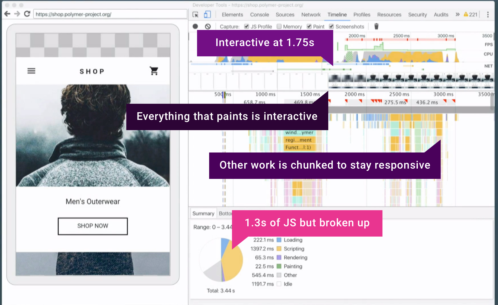
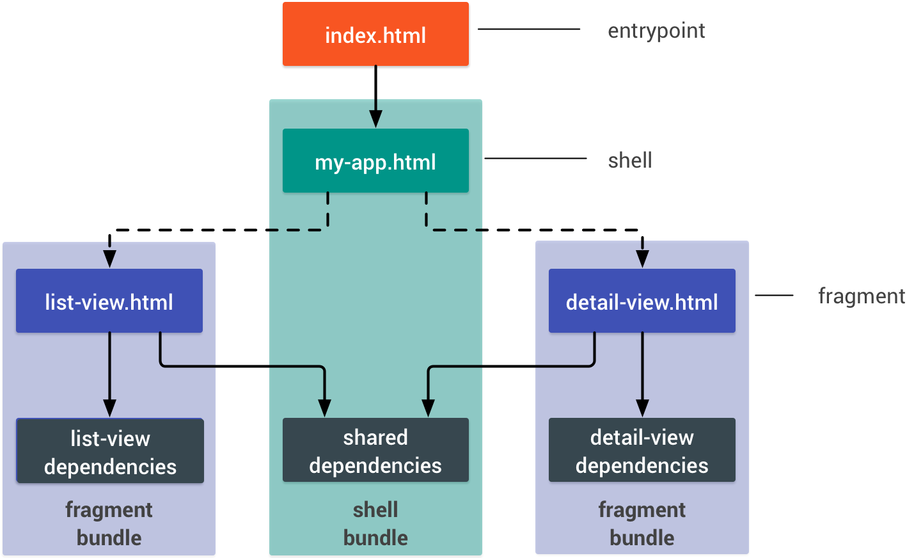

project_path: /web/_project.yaml
book_path: /web/fundamentals/_book.yaml
description: 

{# wf_updated_on: 2016-09-28 #}
{# wf_published_on: 2016-09-28 #}

# The PRPL Pattern {: .page-title }



Dogfood: PRPL is a pattern we believe makes sense for applications that can
be granularly served. It is currently considered experimental, however we plan on publishing 
more data on where it works well in the future. 

## Introduction

The web was not initially designed to build modern, highly-interactive applications.

Over the years, we've used JavaScript to try filling this gap. We've invented clever models for structuring
our apps, built libraries and frameworks to implement them, and layered lots of other useful
features on top. We've also constructed elaborate tool chains to build and serve and bundle and split
our JavaScript code. These innovations have filled the gaps in the web platform, but they've also
added cost in the form of complexity, developer lock-in and JavaScript overhead.

This overhead was a fine tradeoff for the desktop web, where big beefy machines with
fast CPUs are connected via wire or WiFi to the internet. But **the advent and reach
of the _mobile_ web fundamentally changes the equation**. Flaky, slow data connections are
the norm. Underpowered CPUs and tight on-device memory are the norm. And as the next
billion users come online, many of them are coming online with the most challenging
combinations of data and device.

Fortunately, the web platform is evolving to meet these challenges:

* Thanks to
[Service Worker](/web/fundamentals/primers/service-worker/), developers
have a way to reliably cache these granular components, to ensure their web applications can
still function and perform reliably even in flaky network conditions.

* Thanks to
[HTTP/2](https://http2.github.io/), developers have a way to efficiently deliver granular
dependencies over the network without incurring the high overhead of multiple round-trips.

* Thanks to
[Web Components](http://webcomponents.org/), developers have a way to extend HTML itself:
to unlock the powerful component model that's baked directly into the browser and build an
application out of granular, low-overhead components.

## Towards granular serving

Today's web platform is a first-class platform for developing and delivering apps. It can
however benefit from patterns that rethink the "bundle-all-the-things" approach commonly taken to 
delivering JavaScript-rich applications. Fetching and running less code is always better. 

By delivering resources at something close to the granularity in which they are authored
(in at least functionally independent modules that are as small as reasonably possible), it's
possible to only serve users the minimal code needed to get a route **interactive**. Route-based
chunking breaks up the work and loads the code for routes more modularly. 

This has huge implications on web performance and has other advantages, such as caching 
efficiency (as new versions of an application are released over time). Route-based chunking is one 
good step forward and can be accomplished using modern tools like the 
[Polymer App Toolbox](https://www.polymer-project.org/1.0/toolbox/), [Webpack](https://webpack.github.io/) 
or [JSPM](https://jspm.io).

But, it's possible to use the web platform to squeeze out even more performance wins from our apps.

## The PRPL pattern

To optimize delivery of finely granular applications, the Polymer team discovered the 
[PRPL pattern](https://www.youtube.com/watch?v=J4i0xJnQUzU), which stands for:

*  **Push** critical resources for the initial route.
*  **Render** initial route.
*  **Pre-cache** remaining routes.
*  **Lazy-load** and create remaining routes on demand.

To do this, the server needs to be able to identify the resources required by each of the app's
routes. Instead of bundling the resources into a single unit for download, it (optionally) uses 
HTTP2 push to deliver the individual resources needed to render the requested route.

The server and service worker together work to precache the resources for the inactive routes.

When the user switches routes, the app lazy-loads any required resources that haven't been cached
yet, and creates the required views. Repeat visits to routes should be immediately interactive. 
Service Worker helps a lot here.

Polymer's [Shop](https://shop.polymer-project.org) demo is a first-class example of an application
using PRPL to granularly serve resources. It achieves interactivity for each route 
incredibly quickly on real-world mobile devices:

## App structure

PRPL can work well if you have a single-page app (SPA) with the following structure:

-   The main _entrypoint_ of the application which is served from every valid route. This
    file should be very small, since it will be served from different URLs therefore be cached
    multiple times. All resource URLs in the entrypoint need to be absolute, since it may be served
    from non-top-level URLs.

-   The _shell_ or app-shell, which includes the top-level app logic, router, and so on.

-   Lazily loaded _fragments_ of the app. A fragment can represent the code for a particular
    view, or other code that can be loaded lazily (for example, parts of the main app not required
    for first paint, like menus that aren't displayed until a user interacts with the app). The
    shell is responsible for dynamically importing the fragments as needed.

The diagram below shows the components of a simple app that might be structured using 
[Web Components](http://webcomponents.org/):

Note: although HTML Imports are Polymer's preferred bundling strategy, you can use code-splitting
and route-based chunking to get a similar setup achieved with modern JavaScript module bundlers 

In this diagram, the solid lines represent _static dependencies_, external resources identified
in the files using `<link>` and `<script>` tags. Dotted lines represent _dynamic_ or _demand-loaded
dependencies_: files loaded as needed by the shell.

The build process builds a graph of all of these dependencies, and the server uses this information
to serve the files efficiently. It also builds a set of vulcanized bundles, for browsers that don't
support HTTP2 push.

### App entrypoint

The entrypoint must import and instantiate the shell, as well as conditionally load any
required polyfills.

The main considerations for the entrypoint are:

-   Has minimal static dependencies—not much beyond the app-shell itself.
-   Conditionally loads required polyfills.
-   Uses absolute paths for all dependencies.

### App shell

The shell is responsible for routing and usually includes the main navigation UI for the app.

The app should lazy-load fragments as they're required. For example, when the
user changes to a new route, it imports the fragment(s) associated with that route. This may
initiate a new request to the server, or simply load the resource from the cache.

The shell (including its static dependencies) should contain everything needed for first paint.

## Build output

Although it isn't a hard requirement for using PRPL, your build process could produce two builds:

-   An unbundled build designed for server/browser combinations that support HTTP/2 and
    HTTP/2 server push to deliver the resources the browser needs for a fast first paint while
    optimizing caching.

-   A bundled build designed to minimize the number of round-trips required to get the application
	running on server/browser combinations that don't support server push.

Your server logic should deliver the appropriate build for each browser.

### Bundled build

For browsers that don't handle HTTP2 Push, the build process could produce a set of different bundles:
one bundle for the shell, and one bundle for each fragment. The diagram below shows how a simple
app would be bundled, again using Web Components:

Any dependency shared by two or more fragments is bundled in with the shell and its static
dependencies.

Each fragment and its _unshared_ static dependencies are bundled into a single bundle. The server
should return the appropriate version of the fragment (bundled or unbundled), depending on the browser.
This means that the shell code can lazy-load `detail-view.html` _without having to know whether
it is bundled or unbundled_. It relies on the server and browser to load the dependencies in the
most efficient way.

## Background: HTTP/2 and HTTP/2 server push

HTTP/2 allows _multiplexed_ downloads over a single connection, so that multiple small files can be
downloaded more efficiently.

HTTP/2 server push allows the server to preemptively send resources to the browser.

For an example of how HTTP/2 server push speeds up downloads, consider how the browser retrieves an
HTML file with a linked stylesheet.

In HTTP/1:
*   The browser requests the HTML file.
*   The server returns the HTML file and the browser starts parsing it.
*   The browser encounters the `<link rel="stylesheet">` tag, and starts a new request for the
    stylesheet.
*   The browser receives the stylesheet.

With HTTP/2 push:
*   The browser requests the HTML file.
*   The server returns the HTML file, and pushes the stylesheet at the same time.
*   The browser starts parsing the HTML. By the time it encounters the `<link rel="stylesheet">`,
the stylesheet is already in the cache.

In this simplest case, HTTP/2 server push eliminates a single HTTP request-response.

With HTTP/1, developers bundle resources together to reduce the number of HTTP requests required to
render a page. However, bundling can reduce the efficiency of the browser's cache. if resources for
each page are combined into a single bundle, each page gets its own bundle, and the browser can't
identify shared resources.

The combination of HTTP/2 and HTTP/2 server push can provide the _benefits_ of bundling (reduced
latency) without needing to bundle resources. Keeping resources separate means they can be cached
efficiently and be shared between pages.

## Conclusion

Loading the code for routes more granularly and allowing browsers to schedule work better has the 
potential to be a holy grail for reaching interactivity in our applications sooner. We need **better 
architectures that enable interactivity quickly** and the PRPL pattern is one interesting example of 
how to accomplish this goal on real mobile devices.

It’s all about headroom and giving yourself enough once you’re done loading your abstractions. If tapping 
on a link is delayed by seconds of script that prevents input events from dispatching, that’s 
a strong indication there is work to be done on performance. This is a common problem with applications 
built using larger JavaScript libraries today, where UI is rendered that looks like it should work but 
does not. 

PRPL can help deliver the minimal functional code needed to get the route your users land on interactive,
addressing this challenge.

