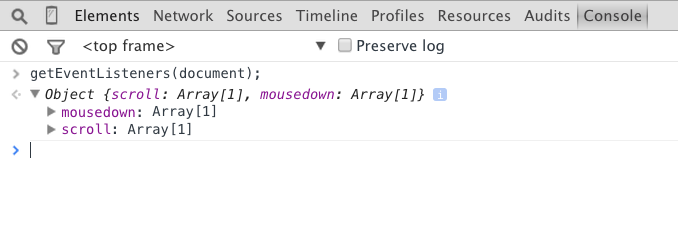
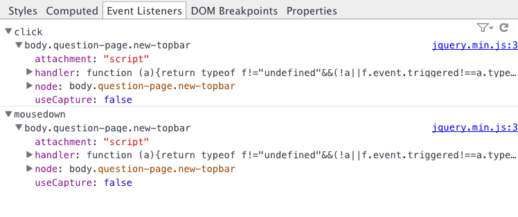

project_path: /web/_project.yaml
book_path: /web/tools/_book.yaml
description: The Chrome DevTools Command Line API offers various ways to observe and inspect event listeners

{# wf_updated_on: 2015-08-02 #}
{# wf_published_on: 2015-04-13 #}

# Monitor Events {: .page-title }



The Chrome DevTools Command Line API offers various ways to observe and inspect event listeners. JavaScript plays a central role in interactive pages, and the browser provides you some useful tools to debug events and event handlers.

## TL;DR
- Listen to events of a certain type using <code>monitorEvents()</code>.
- Use <code>unmonitorEvents()</code> to stop listening.
- Get listeners of a DOM element using <code>getEventListeners()</code>.
- Use the Event Listeners Inspector panel to get information on event listeners.

## Monitor events

The [monitorEvents()](/web/tools/chrome-devtools/debug/command-line/command-line-reference#monitoreventsobject-events)
method instructs the DevTools to log information on the specified targets.

The first parameter is the object to monitor.
All events return if the second parameter is not provided.
To specify the events to listen to,
pass either a string or an array of strings as the second parameter.

Listen to click events on the body of the page:

    monitorEvents(document.body, "click");

If the monitored event is a supported *event type*
that the DevTools maps to a set of standard event names,
then the method listens to the events for that type.

The [Command Line API](/web/tools/chrome-devtools/debug/command-line/command-line-reference) has a full mapping of *event types* to the events they cover.

To stop monitoring events,
call the `unmonitorEvents()` method and give it the object to stop monitoring.

Stop listening to events on the `body` object:

    unmonitorEvents(document.body);

## View event listeners registered on objects

The [getEventListeners() API](/web/tools/chrome-devtools/debug/command-line/command-line-reference#geteventlistenersobject)
returns the event listeners registered on the specified object.

The return value is an object that contains an array for each registered event type (`click` or `keydown`, for example).
The members of each array are objects that describe
the listener registered for each type.
For example,
the following code lists all the event listeners registered on the document object:

    getEventListeners(document);

If more than one listener is registered on the specified object,
then the array contains a member for each listener.
In the following example,
there are two event listeners registered on the #scrollingList element for the `mousedown` event:

Further expand each of these objects to explore their properties:

## View event listeners registered on DOM elements

By default,
the *Event Listeners* panel in the Elements Inspector shows all the events attached to a page:

The filter limits the events just to the selected node:

By expanding the object, the panel shows the event listener details.
In this example,
the page has two event listeners attached via jQuery:

