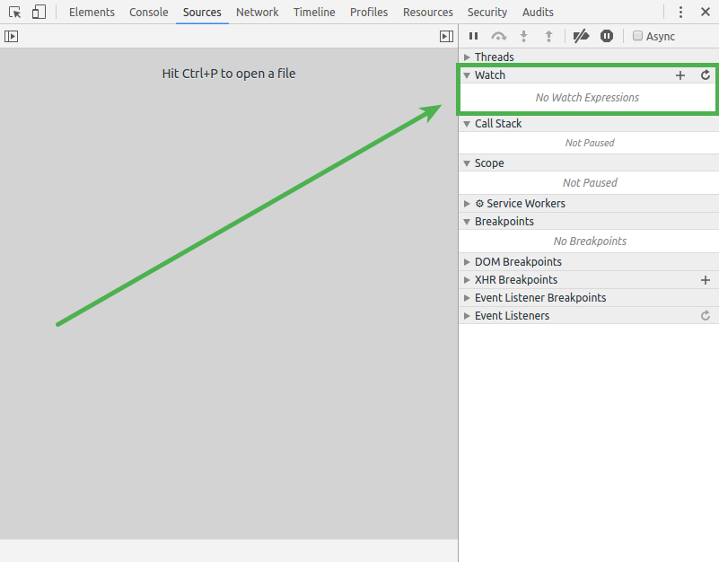
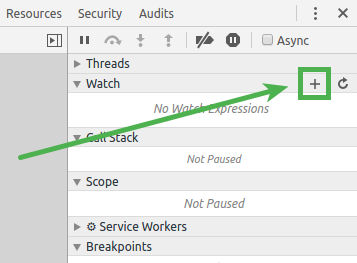
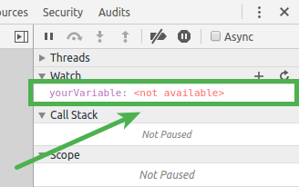
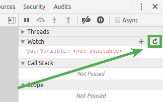
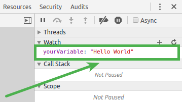
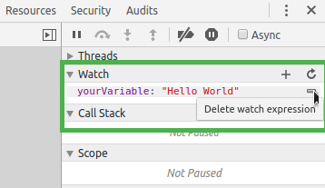

project_path: /web/_project.yaml
book_path: /web/tools/_book.yaml
description: Chrome DevTools allows you to easily see multiple variables throughout your application.

{# wf_published_on: 2016-02-11 #}

# Watch variables in Sources {: .page-title }



Chrome DevTools allows you to easily see multiple variables throughout your application.
Watching variables within Sources keeps you out of the console and focused on improving your code.

The Sources panel provides the ability to watch variables within your application.
This is located in the watch section of the debugger sidebar.
By taking advantage of this functionality you will not need repeatedly log objects to the console.

## Adding variables

To add a variable to the watch list use the add icon to the right of the section heading.
This will open an inline input where you provide the variable name to watch.
Once it is filled in press your <kbd>Enter</kbd> key to add it to the list.

The watcher will show you the current value of the variable as it is added.
If the variable is not set or can't be found it will show <samp>&lt;Not Available&gt;</samp> for the value.

## Updating variables

Variable values may change as an application continues to operate.
The watch list is not a live view of the variables unless you are stepping through execution.
When you are stepping through execution using [breakpoints](/web/tools/chrome-devtools/debug/breakpoints), the watched values will update automatically.
To manually recheck the variables in the list press the refresh button to the right of the section heading.

As the refresh is requested the current application state is rechecked.
Every watched item will be updated with the current values.

## Removing variables

To keep what your are looking at minimal for faster work you may need to remove variables from the watch list.
This can be done by hovering the variable and then clicking the removal icon that appears to the right.

