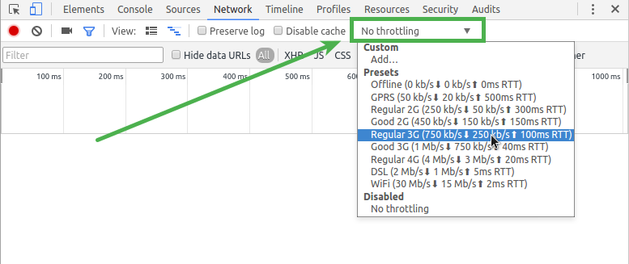
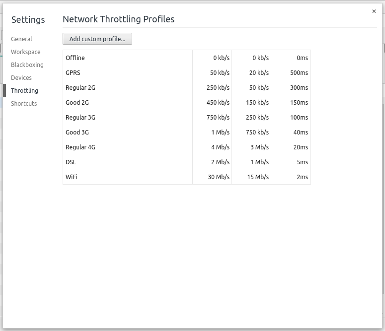
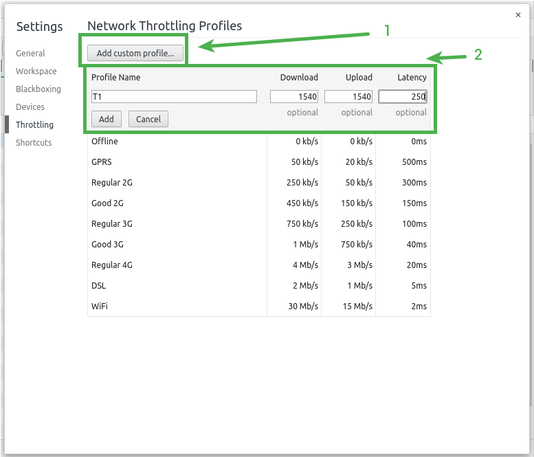
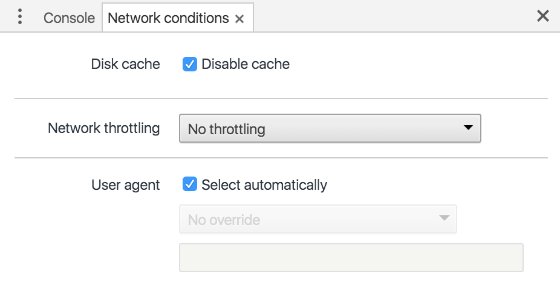
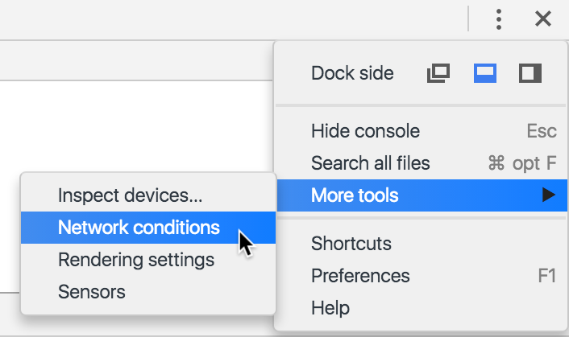

project_path: /web/_project.yaml
book_path: /web/tools/_book.yaml
description: It’s easy to overlook the network conditions your users will face on mobile. Use DevTools to emulate different network conditions. Fix any load time issues and your users will thank you.

{# wf_updated_on: 2015-07-20 #}
{# wf_published_on: 2015-04-13 #}

# Optimize Performance Under Varying Network Conditions {: .page-title }




It’s easy to overlook the network conditions your users will face on mobile. Use DevTools to emulate different network conditions. Fix any load time issues and your users will thank you.

## TL;DR
- Without affecting traffic to other tabs, evaluate your site''s performance using the Chrome DevTools network emulator.
- Use custom profiles that are specific to your audiences network conditions.

## Emulate network connectivity

Network conditioning allows you to test your site on a variety of network connections, including Edge, 3G, and even offline.
It throttles the maximum download and upload throughput (rate of data transfer).
Latency manipulation enforces a minimum delay in connection round-trip time (RTT).

Network Conditioning is turned on through the Network panel.
Select a connection from the dropdown to apply network throttling and latency manipulation.

**Tip**: You can also set network throttles via the 
[Network conditions](#network-conditions) drawer.

When a Throttle is enabled the panel indicator will show a warning icon.
This is to remind you that throttling is enabled when you are in other panels.

## Custom throttles

DevTools provides a solid foundation of default conditions.
You may need to add custom conditions to cover your audiences primary conditions.

To add a condition open the dropdown to apply a condition.
Under the **custom** header find and select the **Add...** option.
This will open the DevTools settings dialog with the "Throttling" tab open.

First, click the **Add custom profile** button.
This opens an inline form to supply the profiles conditions.
Accurately fill the form out then press the **Add** button when it meets your needs.

You may modify an existing custom profile by hovering the entry.
On hover the **Edit** and **Delete** icons are shown to the right of the entry.

Now you may close the settings dialog.
Your new custom profiles will be shown under the **custom** header to select a condition.

## Open the network conditions drawer {:#network-conditions}

You can access network functions while other DevTools panels are open with
the **Network conditions** drawer. 

Access the drawer from the DevTools main menu (**Main Menu** > **More Tools** >
**Network Conditions**).

